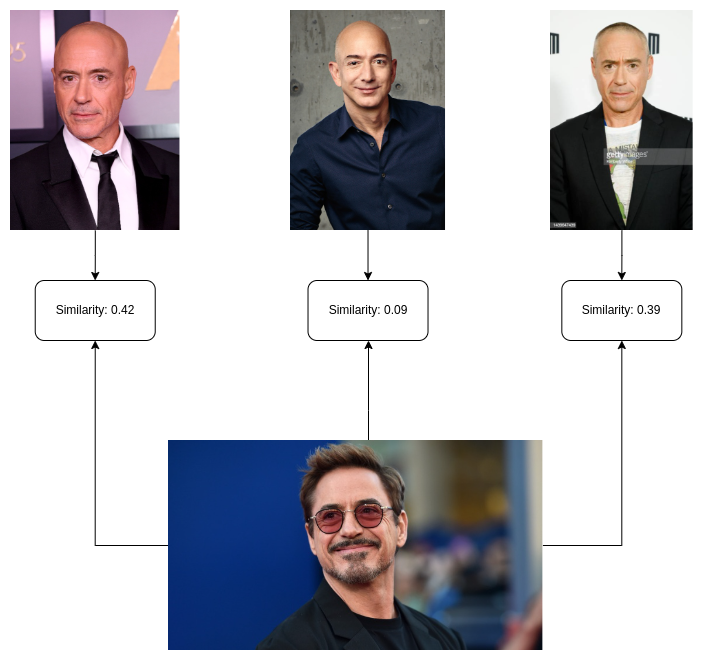

Face Identification inference code using ONNX Runtime

### Installation

```
conda create -n ONNX python=3.8
conda activate ONNX
conda install pytorch torchvision torchaudio pytorch-cuda=11.6 -c pytorch -c nvidia
pip install onnxruntime-gpu==1.14.0
pip install opencv-python==4.5.5.64
```

### Test

* Run `python main.py a.jpg b.jpg` for testing

### Note

* This repo supports inference only, see reference for more details

### Results



#### Reference

* https://github.com/mk-minchul/AdaFace
* https://github.com/deepinsight/insightface/tree/master/web-demos
* https://github.com/deepinsight/insightface/tree/master/detection/scrfd
